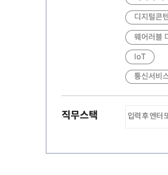
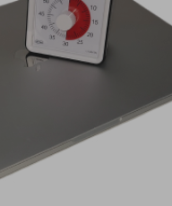

# 이것은 h1 입니다.

## 이것은 h2 입니다.

### 이것은 h3 입니다.

---

1. 동해물과 백두산이 마르고 닳도록
   하느님이 보우하사 우리나라 만세
   무궁화 삼천리 화려 강산
   대한 사람 대한으로 길이 보전하세
2. 남산 위에 저 소나무 철갑을 두른 듯
   바람 서리 불변함은 우리 기상일세
   무궁화 삼천리 화려 강산
   대한 사람 대한으로 길이 보전하세
3. 가을 하늘 공활한데 높고 구름 없이
   밝은 달은 우리 가슴 일편단심일세
   무궁화 삼천리 화려 강산
   대한 사람 대한으로 길이 보전하세
4. 이 기상과 이 맘으로 충성을 다하여
   괴로우나 즐거우나 나라 사랑하세
   무궁화 삼천리 화려 강산
   대한 사람 대한으로 길이 보전하세

- 커버 이미지 사진입니다.
  
- 400x300 크기의 사진입니다.
  
- 1000x2600 크기의 사진입니다.
  
